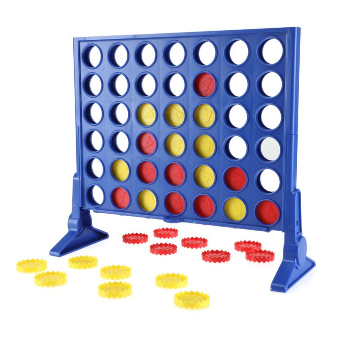
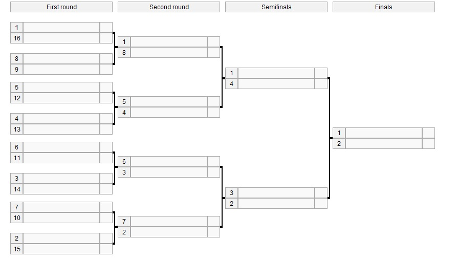
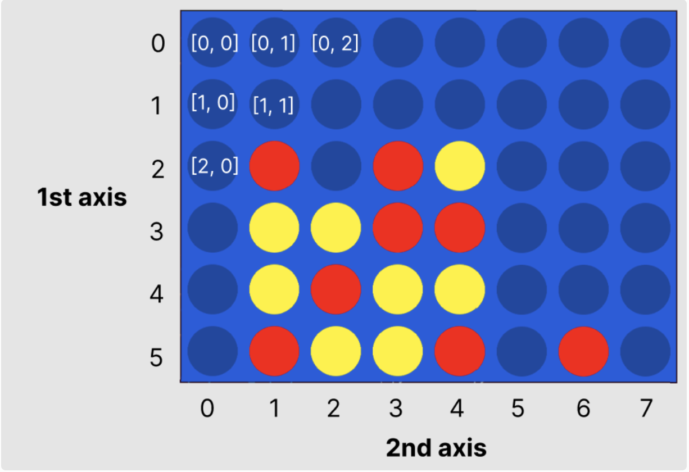

## RL to play Connect 4 :yellow_circle::red_circle::yellow_circle::red_circle:

Connect 4 is a classic board game.

## Rules of Connect 4 :red_circle:

Connect 4 is a **two-player** board game. Players take turns dropping colored counters into grid. Each player **plays a single color** only. The pieces **fall straight down** to the lowest available space in the column.

**The goal is to form a horizontal, vertical, or diagonal line of 4 of your counters.**

You can play with your teammate here: https://boardgames.io/en/connect4.

Your task is to build a **Reinforcement Learning agent** that plays **Connect 4**

# Competition Rules :crossed_swords:

1. You must build a **Reinforcement Learning** agent.
   - Rules-based agents **aren't allowed**!
2. You can only write code in `main.py` and you can only store data in a dictionary (saved in a `.pkl` file by `save_dictionary()`*)
    - In the competition, your agent will call the `choose_move()` function in `main.py` to select a move
    - Any code not in `main.py` **will not be used**.
    - **Check your submission is valid with `check_submission()`**
3. Submission deadline: **4pm GMT, Sunday**.
   - You can update your code after submitting, but **not after the deadline**.
   - Check your submission is valid with `check_submission()`

  *`save_dictionary()` is a function in `game_mechanics.py`

## Competition Format :crossed_swords:

The competition will consist of your AI playing other teams' AIs 1-v-1 in a knockout tournament.

Each 1-v-1 matchup consists of a **single game** with the **first player to play chosen randomly**. If the game is a draw, another game will be played with the other player starting first.

The competition & discussion will be in [Gather Town](https://app.gather.town/app/nJwquzJjD4TLKcTy/Delta%20Academy) at **5pm GMT on Sunday** (1 hour after submission deadline)!

## Technical Details :hammer:

We strongly suggest you use a feature lookup table. Read `feature_vectors.md` for a short recap of feature vectors.

### States :yellow_circle:

Unlike typical Connect 4, where there are 7 columns and 6 rows, we’re using **8 columns**. The board is a 6x8 `numpy` array.

The **first axis is the row index** and the **2nd axis is the column index**.

The below image shows this visually. The numbers in square brackets (in the top-left) show how different elements in the array can be referenced.

The pieces are integers in this array. An empty space is `0`. Your pieces are denoted `1`. Your opponent's pieces are denoted `-1`.

Since there are `3 ** 48 = 1e23` possible states, we strongly suggest you use feature vectors to reduce the state space. See `feature_vectors.md` in this repl for more a refresher on feature vectors.

### Actions :axe:

**The index (0 -> 7) of the column to drop your counter into.** In the above diagram, this is the number on the **2nd Axis**. The index of a column that is full (there are no spaces left) is an invalid action.

### Rewards :moneybag:

You received `+1` for winning, `-1` for losing and `0` for a draw. You receive `0` for all other moves.

## Functions you write :point_left:

<code style="white-space:nowrap;">  train()</code>

Write this to train your value function dictionary from experience in the environment. Use TD learning.
 
 
Output the trained dictionary so it can be saved.

<code style="white-space:nowrap;">  to_feature_vector()</code>

Write this to convert a state into a feature vector. These features are used to represent the state in the value function lookup table.
 
 
Input is the state (np array) and output is a tuple which you design! The better the features you pick out, the faster your agent will learn and better it can be at Connect-4.
 
 
Too detailed of a feature vector and it'll take a long time to train. Not enough detail and your agent will hit a ceiling since too many varied states will look identical. E.g. if your feature was just "number of pieces played by me", there are many different states with the same number of pieces played (and thus the same value function).

## Existing Code :pray:

### Need to Know

<code style="white-space:nowrap;">  Env</code> class

The environment class controls the game and runs the opponent It should be used for training your agent.
 
 
See example usage in <code style="white-space:nowrap;">play_connect_4_game()</code>.
 
 
The opponent's <code style="white-space:nowrap;">choose_move</code> function is input at initialisation (when <code style="white-space:nowrap;">Env(opponent_choose_move)</code> is called). The first player is chosen at random when <code style="white-space:nowrap;">Env.reset()</code> is called. Every time you call <code style="white-space:nowrap;">Env.step()</code>, 2 moves are taken - yours and then your opponent's. Your opponent sees a 'flipped' version of the board, where his pieces are shown as <code style="white-space:nowrap;">1</code>'s and yours are shown as <code style="white-space:nowrap;">-1</code>'s.
     
     
    Both <code style="white-space:nowrap;">  Env.step()</code> and <code style="white-space:nowrap;">  Env.reset()</code> have <code style="white-space:nowrap;">  verbose</code> arguments which print debugging info to console when set to <code style="white-space:nowrap;">True</code>.

<code style="white-space:nowrap;">  choose_move()</code>

This acts greedily given the state and value function dictionary.
 
 
In the competition, the <code style="white-space:nowrap;">choose_move()</code> function is called to make your next move. Takes the state as input and outputs an action.
 
 
Also has a <code style="white-space:nowrap;">verbose</code> mode, which when set to <code style="white-space:nowrap;">True</code> prints to console the possible actions, their corresponding features if taken and the values of those feature vectors. Useful for debugging.

<code style="white-space:nowrap;">  choose_move_randomly()</code>

Like above, but randomly picks from non-full columns.
 
 
Takes the state as input and outputs an action.

<code style="white-space:nowrap;">  play_connect_4_game()</code>

Plays 1 game of Connect 4, which can be visualsed either in the console (if <code style="white-space:nowrap;">verbose=True</code>) or rendered visually (if <code style="white-space:nowrap;">render = True</code>). Outputs the return for your agent.
 
 
Inputs:

<code style="white-space:nowrap;">your_choose_move</code>: Function that takes the state and outputs the action for your agent.

<code style="white-space:nowrap;">opponent_choose_move</code>: Function that takes the state and outputs the action for the opponent.

<code style="white-space:nowrap;">game_speed_multiplier</code>: controls the gameplay speed. High numbers mean fast games, low numbers mean slow games.

<code style="white-space:nowrap;">render</code>: whether to render the game visually.

<code style="white-space:nowrap;">verbose</code>: whether to print to console each move and the corresponding board states.

## Other code :gear:

There are **a load** of functions in `game_mechanics.py`. The useful functions are clearly indicated and are explained in their docstrings. **Feel free to use these, but don't change them.** This is because the original `game_mechanics.py` file will be used in the competition.

If you want to tweak one, copy-paste it to `main.py` and rename it.

## Suggested Approach :+1:

1. Discuss which features should be in the feature vector - what corresponds with a good Connect 4 game state? What about a bad one?
2. **Write `train()`**, borrowing from past exercises
3. **Iterate, iterate, iterate** on that `to_feature_vector()` function
