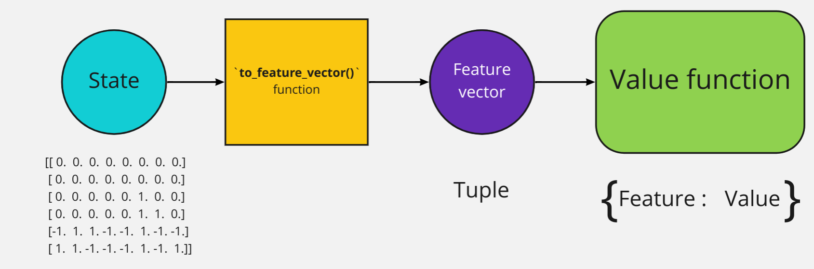

# Recap: Feature Vectors

They were introduced through [Tutorial 6](https://calm-silver-e6f.notion.site/6-Feature-Vectors-47ad24b24020420b813056a90f446b19),
with the final exercise in that tutorial required you to build a set of features that can be used by 
an RL algorithm to learn to play Tic-Tac-Toe.

Feature lookup tables have the advantage of generalising to not-seen-before states. This:
1. **Reduces the memory requirements of the lookup table** by reducing the number of entries (not a problem with Tic-Tac-Toe, but is a problem with Connect 4)
2. **Reduce the time spent training** by reducing the number of parameters that need to be learned

It does both of these by sharing value estimates between similar states.
How is **similar** defined? It's defined by the designer. In this case,
that's you.

### How do I design a feature vector?

First, think about what the **value of a state** would be in the MDP you're trying to solve. 
For example, **in a game of chess**, a state where you've taken their queen would be higher value 
than the identical state where they still have their queen.

So **whether their queen has been taken** (could be represented by a 0 or a 1) could be a feature.

Another feature could be **whether you have your opponent in checkmate**. You need to identify
this so your 1-step lookahead greedy function can identify states where it wins and choose those.

In general, ask yourself: **what are the key features that affect how valuable a state is in 
this game?**

The feature state doesn't actually have to be a consistent length, although it's recommended that 
it is, otherwise you may get 2 feature vectors that refer to different features looking
identical to the value function.
